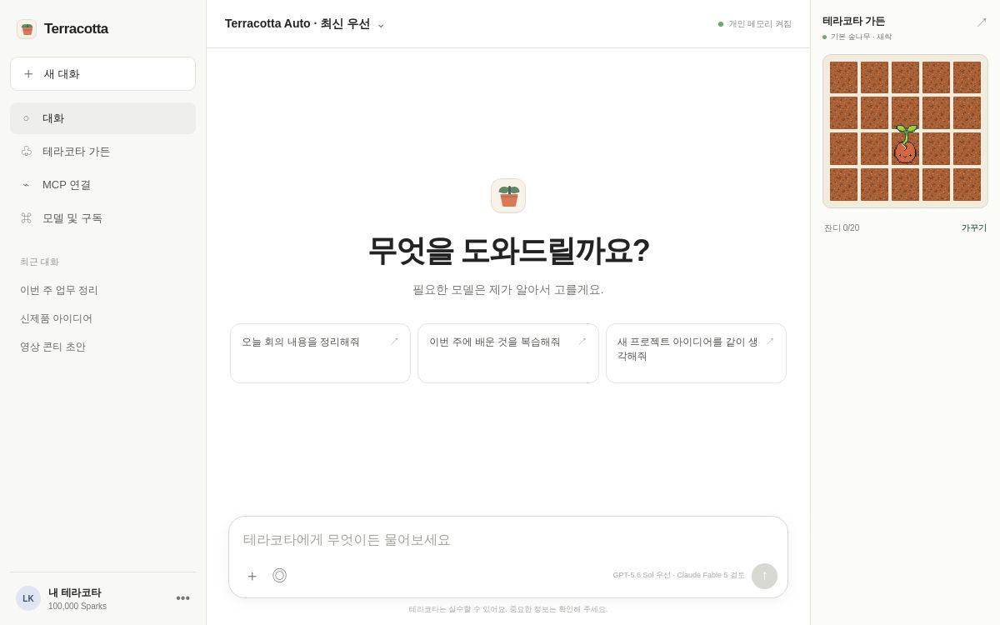
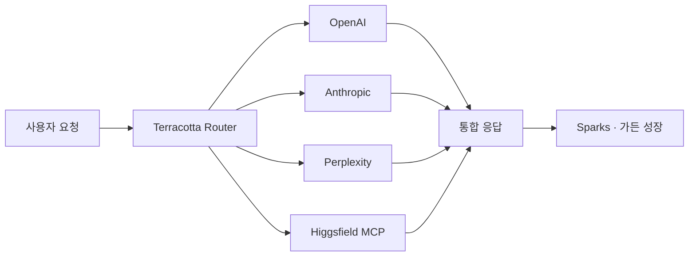

<p align="center">
  
</p>

<h1 align="center">Terracotta</h1>

<p align="center">
  <strong>가장 잘하는 AI를 골라 쓰고, 사용할수록 나만의 지식 정원이 자라는 개인 AI 작업실.</strong>
</p>

<p align="center">
  <a href="https://orbit-ai-companion.likecorp817.chatgpt.site">Live prototype</a>
  ·
  <a href="#로컬에서-실행하기">Run locally</a>
  ·
  <a href="#로드맵">Roadmap</a>
</p>



## Terracotta란?

Terracotta는 GPT, Claude, Perplexity, Higgsfield처럼 서로 다른 강점을 가진 AI를 한 화면에서 다루기 위한 멀티 모델 AI 동반자입니다. 사용자는 `최신 모델 우선`, `GPT 우선`, `Claude 우선` 중 하나를 고르고, Terracotta는 작업 성격에 맞는 모델을 조합합니다.

완료한 작업과 AI 사용량은 **Sparks**로 쌓입니다. Sparks로 5×4 비트맵 가든에 잔디를 한 칸씩 심고, 아이템을 구매해 자유롭게 배치하며, 중앙의 Terracotta 캐릭터를 씨앗에서 큰 나무로 키울 수 있습니다.

## 현재 구현된 것

- **멀티 모델 라우터** — OpenAI, Anthropic, Perplexity, Higgsfield 연결 상태와 사용량 예산을 한곳에서 관리합니다.
- **자동 모델 레지스트리** — 연결된 공급사의 모델 목록을 주기적으로 확인하고 최신 우선순위를 갱신합니다.
- **개인화된 모델 우선순위** — 최신 모델, GPT, Claude 중 사용자가 직접 기본 순서를 정합니다.
- **5×4 비트맵 가든** — 흙에서 시작해 잔디를 한 칸씩 심고, 같은 잔디 20칸을 채우면 하나의 이어진 정원이 됩니다.
- **자유 배치 가드닝** — 장식과 Terracotta 캐릭터를 타일에 묶이지 않은 좌표로 드래그하고 기기에 저장합니다.
- **가드닝 스토어** — 꽃, 장식, 친구, 도구, 텃밭과 성장 모습이 다른 나무를 Sparks로 구매합니다.
- **MCP Hub** — GitHub, Notion, Figma, Linear, Google Drive, Slack 등 다양한 MCP 연결을 검색하고 관리합니다.
- **보안 중심 MCP OAuth** — PKCE S256, AES-GCM 토큰 암호화, HTTPS 전용 연결과 내부 네트워크 주소 차단을 적용합니다.
- **구독 프로토타입** — 모델·검색·이미지·영상 사용량을 함께 고려한 크레딧 플랜과 월간 공급사 비용 가드를 제공합니다.

## 제품 흐름



## 기술 구성

- Next.js 16 + React 19
- vinext + Cloudflare Workers
- Cloudflare D1 + Drizzle ORM
- 공급사별 모델 레지스트리 및 사용량 원장
- Streamable HTTP MCP + OAuth 2.0/PKCE
- OpenAI Sites 배포 설정

## 로컬에서 실행하기

### 요구 사항

- Node.js `>=22.13.0`
- npm

### 설치

```bash
git clone https://github.com/hyunaeee/terracotta.git
cd terracotta
npm install
copy .env.example .env.local
npm run dev
```

개발 서버가 안내하는 로컬 주소를 브라우저에서 열면 됩니다. macOS와 Linux에서는 `copy` 대신 `cp`를 사용하세요.

### 환경 변수

| 변수 | 용도 |
| --- | --- |
| `OPENAI_API_KEY` | OpenAI 모델 및 모델 레지스트리 연결 |
| `ANTHROPIC_API_KEY` | Claude 모델 연결 |
| `PERPLEXITY_API_KEY` | 웹 검색·리서치 모델 연결 |
| `HIGGSFIELD_MCP_CONNECTED` | Higgsfield MCP 인증 상태 |
| `TERRACOTTA_MONTHLY_BUDGET_USD` | 월간 공급사 비용 한도 |
| `MCP_TOKEN_ENCRYPTION_KEY` | MCP OAuth 토큰 암호화용 32바이트 base64 키 |

암호화 키 예시:

```bash
node -e "console.log(require('crypto').randomBytes(32).toString('base64'))"
```

API 키는 서버 환경변수로만 설정하고 `NEXT_PUBLIC_` 접두사를 붙이지 마세요.

## 주요 명령

| 명령 | 설명 |
| --- | --- |
| `npm run dev` | 로컬 개발 서버 실행 |
| `npm run build` | 배포용 빌드 생성 |
| `npm test` | 빌드 및 핵심 제품 동작 검증 |
| `npm run lint` | 코드 정적 검사 |
| `npm run db:generate` | Drizzle 마이그레이션 생성 |

## 프로젝트 구조

```text
app/                     UI와 API routes
lib/terracotta-router.ts 모델 레지스트리·라우팅·비용 기록
lib/mcp-hub.ts           MCP 연결·OAuth·도구 호출
db/                      D1 스키마
drizzle/                 데이터베이스 마이그레이션
public/assets/garden/    개별 비트맵 가드닝 아이템
public/assets/mcp/       MCP 서비스 브랜드 아이콘
tests/                   제품 동작 검증
```

## 로드맵

- **Terracotta Local Agent** — 사용자가 허용한 로컬 프로젝트를 Codex와 Claude Code가 안전하게 읽고 수정
- **격리된 Git worktree 실행** — 각 에이전트의 패치를 분리한 뒤 테스트와 검토를 거쳐 선택적으로 반영
- **개인 모델 성과 라우팅** — 테스트 통과율, 패치 수락률, 비용과 속도를 바탕으로 사용자별 최적 모델 선택
- **암호화된 개인 메모리** — 사용자가 승인한 데이터만 장기 기억으로 저장
- **가든 동기화** — 여러 기기에서 성장 단계와 꾸민 정원을 이어서 사용

## 현재 상태

Terracotta는 제품 방향과 핵심 상호작용을 검증하는 초기 프로토타입입니다. 실제 모델 응답, MCP OAuth, 비용 기록에는 각 공급사의 공식 API 또는 계정 인증이 필요합니다. 소비자용 AI 구독과 공급사 API 사용료는 서로 별개일 수 있습니다.

## License

Copyright © 2026 Terracotta. 현재 별도의 오픈소스 라이선스는 부여하지 않습니다.
